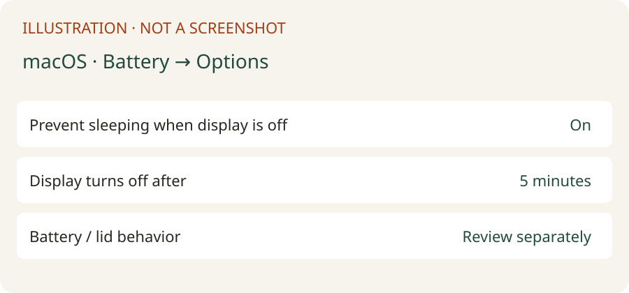
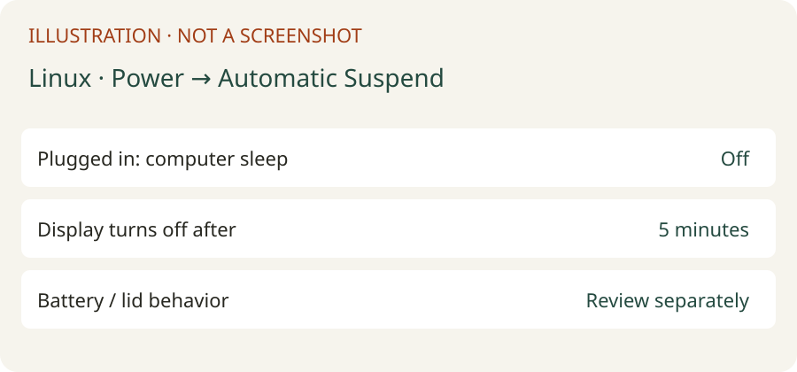
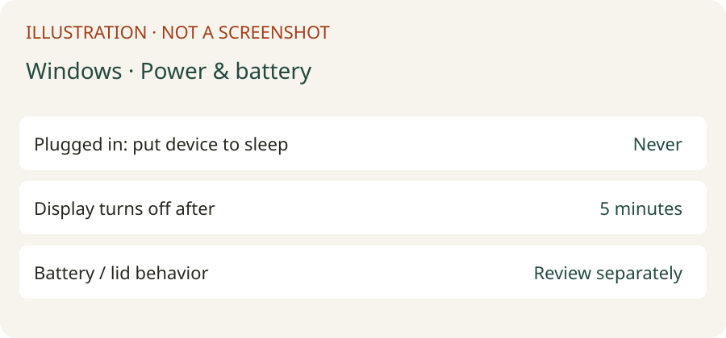

# Keep your computer awake

Your phone needs the computer to stay on and connected. **The screen can turn off while the computer keeps working.** Start with mains power and an open laptop lid. Keeping a battery-powered laptop awake increases heat and drain; never put a running laptop in a bag. This does not prevent shutdown, battery exhaustion, firmware safety actions or network outages.

[AI tool setup](/docs/setup-agents/) · [Install Agent J](/docs/install/) · [On your computer](/docs/computer/) · [Manual installation](/install/)

## Give this to your Agent

Copy this request into your Agent conversation. With Agent J, the administrator password belongs on the paired phone card, never in chat. The button copies the same request and opens your Agent J phone page; select your paired computer and paste/send it yourself. The website does not send commands to a host.

```text
Configure this computer to remain reachable for remote Agent work while allowing its display to turn off. Identify macOS, a native Linux systemd host, or Windows/WSL first. Read https://agentj.app/docs/keep-awake/en.md. Prefer the installed agentj keep-awake command: status --json, on --dry-run --json, then on --json; allow the shell call up to 10 minutes for paired-phone approval. Default to AC power on macOS; keep the lid open and do not change battery policy without explaining heat/drain and obtaining the owner's preference. Root operations must use Agent J's existing phone password card; never request a password in chat, ask the owner to type terminal commands, use osascript with administrator privileges, or open a local authorization dialog. If the command is unavailable, inspect supported OS-native commands and preserve original settings before applying equivalent changes through agentj sudo. WSL changes cannot keep Windows awake: report the host operation needed, never claim success inside WSL. Do not edit PAM, disable Touch ID/Watch or set disablesleep automatically. If sudo reports local biometric authorization, explain that remote password submission alone cannot finish it and stop only that dependent operation. Read back the effective settings after applying; report AC/battery sleep policy, screen/lid limitations, whether verification passed, any reboot or host-side step needed, and how to restore the saved originals with agentj keep-awake off. Never infer success from an exit code alone.
```

Candidate command: available after installing the host release that contains this feature. An older host may report an unknown command; it does not mean your password is wrong.

## macOS

### Command line

Agent J's command uses `pmset`, defaults to **AC only**, leaves display and battery timers unchanged, saves the original sleep timers, and verifies the readback. No `disablesleep` is set.

View the current settings (AC and Battery sections):

```bash
pmset -g custom
```

Preview without writes or phone cards:

```bash
agentj keep-awake on --dry-run --json
```

Apply using the phone password card:

```bash
agentj keep-awake on --json
```

Verify:

```bash
agentj keep-awake status --json
```

For deliberate battery use (more drain; not a lid workaround):

```bash
agentj keep-awake on --power battery --json
```

Restore the original timers saved by this command:

```bash
agentj keep-awake off --json
```

Without Agent J, for local manual installation only: record `pmset -g custom` first, then disable idle sleep on mains. An installed Agent should run the underlying command through `agentj sudo` instead of sending you to Terminal.

```bash
sudo pmset -c sleep 0
```

Read back `sleep 0` under AC. To restore, replace `20` below with the **original AC sleep minutes you recorded**, not an assumed default:

```bash
sudo pmset -c sleep 20
```

`-c` = charger, `-b` = battery, `-a` = both. `sleep 0` disables idle sleep; it does not guarantee a MacBook stays awake when closed. Prefer an open lid; supported closed-display operation requires the model's external-display/power setup. Do not use `pmset disablesleep 1` as a routine fix: it changes broader sleep behavior, can cause heat/drain, and needs separate explicit choice and verification. `caffeinate -i` is temporary and lasts only while its process runs.

### System Settings

1. Apple menu → System Settings → Battery → Options (laptops). Enable “Prevent automatic sleeping on power adapter when the display is off”. Desktop Macs: Energy → prevent automatic sleeping; wording varies by macOS/model.
2. Lock Screen → choose a display-off timer for the power adapter. This is separate from computer sleep; you may leave the display timer short.
3. Keep the laptop open and plugged in. Read `pmset -g custom` again and check the phone remains connected after the display turns off.
4. To undo, put the switch/timers back to the values you recorded. Factory defaults differ by hardware/macOS; `off` restores Agent J's own saved values only, not manual GUI changes.



Illustration, not a real screenshot. Mac window capture was unavailable in this environment. [Apple sleep settings](https://support.apple.com/guide/mac-help/set-sleep-and-wake-settings-mchle41a6ccd/mac)

### A second password or Touch ID dialog on the computer

The phone may ask Face ID/passkey to approve its card, then a computer login password. Those are separate expected checks **on the phone**. A further dialog **on the Mac** is different. `sudo -S -k` accepts a password on stdin, but a configured `pam_tid.so`/`pam_reattach.so`/Watch module may request local authorization before password authentication. Agent J detects known enabled modules, warns on the signed card and refuses the password sudo execution rather than hanging on a remote dialog. The preflight cannot prove arbitrary third-party PAM modules are safe.

Inspect without changing anything:

```bash
cat /etc/pam.d/sudo
```

```bash
cat /etc/pam.d/sudo_local
```

If active biometric lines are present, an owner **at the computer** can review them with the commands below and comment only those biometric lines, preserving the password path. Back up the file first; do not replace the entire PAM file. This is a local recovery instruction, not an Agent's remote action.

```bash
sudoedit /etc/pam.d/sudo_local
```

Old configurations may put the lines directly in `/etc/pam.d/sudo`; review that file locally instead. Never remove password authentication. If no such lines exist, inspect which exact command caused the dialog: `osascript … with administrator privileges`, GUI System Settings, and some `security`/`softwareupdate` operations can use macOS Authorization Services independently of the phone password. Agent J must choose a supported direct CLI via its phone sudo card, or clearly report the local requirement. There is no verified universal bypass. [Apple pam_tid source](https://github.com/apple-oss-distributions/pam_modules/blob/main/modules/pam_tid/pam_tid.c)

## Linux

### Command line

For a **native systemd host**, Agent J persistently masks sleep, suspend, hibernate, hybrid-sleep and suspend-then-hibernate targets. It reads their status and logind lid/idle configuration, restores only masks it added, and does not restart logind (which could disconnect you). An already existing runtime mask remains runtime-only; reboot can remove it, so status reports that distinction. A container/WSL is not the host power manager.

View current settings:

```bash
agentj keep-awake status --json
```

Preview:

```bash
agentj keep-awake on --dry-run --json
```

Apply through the paired-phone password card:

```bash
agentj keep-awake on --json
```

Verify targets:

```bash
systemctl is-enabled sleep.target suspend.target hibernate.target hybrid-sleep.target suspend-then-hibernate.target
```

Read logind configuration:

```bash
systemd-analyze cat-config systemd/logind.conf
```

Restore only this command's changes:

```bash
agentj keep-awake off --json
```

For manual installation without Agent J: record existing masks first, then:

```bash
sudo systemctl mask sleep.target suspend.target hibernate.target hybrid-sleep.target suspend-then-hibernate.target
```

To undo a manual mask, unmask **only the targets you added**. Example if sleep.target was originally unmasked:

```bash
sudo systemctl unmask sleep.target
```

logind's `HandleLidSwitch`, `HandleLidSwitchExternalPower`, `HandleLidSwitchDocked` and `IdleAction` determine default lid/idle actions. A desktop power manager can take over these events. Masking targets blocks normal systemd sleep requests, including many lid requests; it cannot promise every firmware or desktop behavior. Keep the lid open, leave screen blanking enabled, and test your actual machine. No logind restart or broad config replacement is automated. [systemd logind reference](https://www.freedesktop.org/software/systemd/man/latest/logind.conf.html)

### Graphical settings

1. GNOME: Settings → Power → Automatic Suspend → turn off “Plugged In”. KDE Plasma: System Settings → Power Management → On AC Power → disable Suspend Session. Names vary by version/distribution.
2. Leave screen blanking/display power saving enabled. Set battery suspend separately only when needed; set lid behavior in your desktop's power settings if exposed.
3. Wait past the old suspend timeout and confirm your paired phone still reaches the host; read the command status as well.
4. Restore the switches/timers you recorded. There is no one Linux-wide factory default. If your desktop has no graphical power panel, use the command route; do not install a desktop panel just for this page.



Illustration, not a real screenshot. This Linux machine has no GNOME/KDE power settings panel.

## Windows

### Command line (Windows host, including WSL users)

Run these in **Windows PowerShell on the host**. WSL's `agentj keep-awake` prints guidance and does not execute Windows power changes or open a local UAC prompt. If elevated rights are required by your policy, perform that host-side step while at the computer; Agent J's Unix phone sudo card cannot approve Windows UAC.

Record the active plan and its sleep/hibernate/lid values:

```powershell
powercfg /getactivescheme
```

```powershell
powercfg /query SCHEME_CURRENT SUB_SLEEP
```

```powershell
powercfg /query SCHEME_CURRENT SUB_BUTTONS
```

Disable idle sleep on AC:

```powershell
powercfg /change standby-timeout-ac 0
```

Disable AC idle hibernation:

```powershell
powercfg /change hibernate-timeout-ac 0
```

Verify the two AC values in the same plan (`0` means no timer):

```powershell
powercfg /query SCHEME_CURRENT SUB_SLEEP
```

Restore original sleep minutes, for example **20 only if that was your recorded value**:

```powershell
powercfg /change standby-timeout-ac 20
```

Restore original hibernate minutes, for example **60 only if recorded**:

```powershell
powercfg /change hibernate-timeout-ac 60
```

`/query` displays setting indexes in hexadecimal **seconds**; `/change` takes **minutes**. Convert seconds to minutes accurately, or use `/setacvalueindex` for an exact original seconds value. Use `-dc` variants only deliberately for battery mode; AC settings do not change battery policy. Avoid `powercfg /restoredefaultschemes`: it deletes custom power plans. Standby timers do not change lid actions or override managed device policies/Modern Standby. Let the display turn off and keep a laptop open and plugged in. [Microsoft powercfg reference](https://learn.microsoft.com/en-us/windows-hardware/design/device-experiences/powercfg-command-line-options)

### Settings and Control Panel

1. Windows 11: Settings → System → Power & battery → Screen, sleep & hibernate timeouts (older builds: Screen and sleep). Set “When plugged in, put my device to sleep after” to Never. Keep the screen-off timer as desired. Windows 10: Settings → System → Power & sleep.
2. Control Panel → Hardware and Sound → Power Options → Choose what closing the lid does. On AC, choose “Do nothing” only if the laptop stays ventilated; leave battery behavior unchanged unless you intend otherwise.
3. Read the host powercfg settings again; leave WSL running and confirm the phone remains connected after the display turns off.
4. Restore your recorded plan values/switches. WSL shutdown or computer restart stops the host even when sleep is disabled.



Illustration, not a real screenshot. A physical Windows screenshot is still needed.
