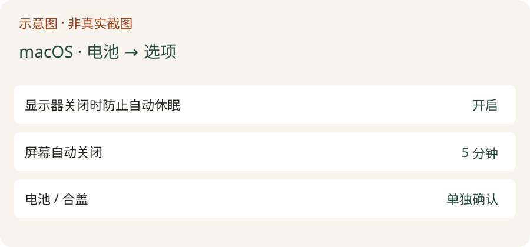
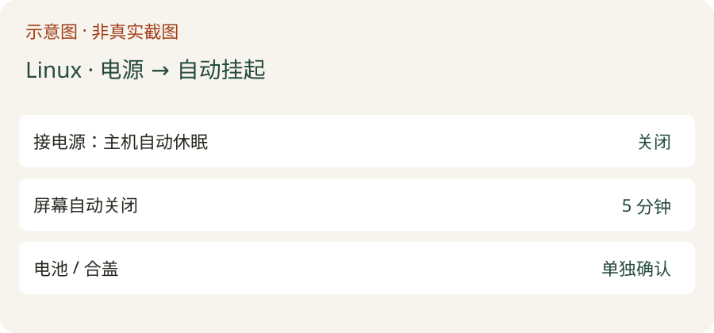
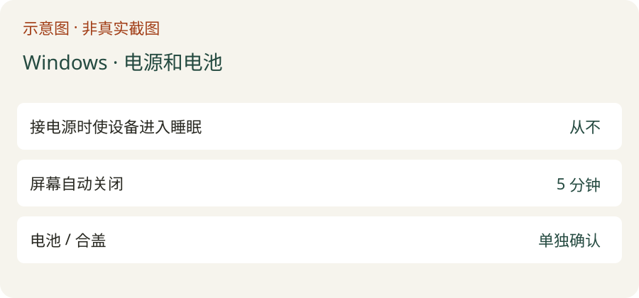

# 让电脑保持唤醒

手机遥控需要电脑持续开机、联网。**屏幕关闭，不等于电脑休眠。** 建议先接电源、保持笔记本开盖。电池供电时持续唤醒会增加耗电和发热，运行中的笔记本不要放进包里。这些设置不能防止关机、电池耗尽、固件保护或断网。

[AI 工具手动安装](/docs/setup-agents/) · [安装 Agent J](/docs/install/) · [电脑端说明](/docs/computer/) · [手动安装](/install/)

## 交给你的 Agent

复制下面的请求，发到你的 Agent 对话里。使用 Agent J 时，管理员密码只填在已配对手机的密码卡里，不能发在聊天里。按钮会复制同一段请求并打开 Agent J 手机页面；选择已配对电脑后，由你粘贴并发送。官网不会直接向电脑发送命令。

```text
请把这台电脑设置为适合远程 Agent 工作的持续在线状态，同时允许屏幕关闭。先判别 macOS、原生 Linux systemd 主机或 Windows/WSL，阅读 https://agentj.app/docs/keep-awake/zh.md。优先使用已安装的 agentj keep-awake 命令：先 status --json，再 on --dry-run --json，确认后执行 on --json；shell 超时设为 10 分钟，给手机审批留足时间。macOS 默认只调整接电源的策略，保持开盖；调整电池策略前说明耗电和发热，并确认主人的偏好。所有 root 操作必须走 Agent J 已有的手机密码卡，不在对话里索要密码，不让主人开终端敲命令，不使用 osascript with administrator privileges，也不触发电脑本机授权窗口。若命令尚未提供，先检查系统支持的原生命令并保存原设置，再通过 agentj sudo 做等价调整。WSL 内的修改不能阻止 Windows 宿主休眠，必须明确报告宿主侧需要的操作，不冒充已成功。不要自动修改 PAM、关闭 Touch ID/Apple Watch 或设置 disablesleep。若 sudo 报告本机生物验证风险，说明手机提交密码不能独立完成，只暂停依赖这项提权的操作。完成后读回有效设置，报告接电源/电池休眠策略、屏幕与合盖限制、验证是否通过、是否需要重启或宿主侧操作，以及用 agentj keep-awake off 恢复本次修改前设置的方法。不能只凭退出码宣称成功。
```

这是候选功能：需安装包含本功能的主机版本。旧版本提示未知命令，不能据此判断密码错误。

## macOS

### 命令行做法

内置命令使用 `pmset`，默认**只改接电源时的主机休眠时间**，保留屏幕和电池策略；先保存原值，完成后读回验证。不设置 `disablesleep`。

查看当前设置，分别看 AC Power 和 Battery Power：

```bash
pmset -g custom
```

只预览，不写文件、不发密码卡：

```bash
agentj keep-awake on --dry-run --json
```

执行，管理员密码填手机卡片：

```bash
agentj keep-awake on --json
```

验证：

```bash
agentj keep-awake status --json
```

明确需要电池供电时也不自动休眠，才使用这一项；它增加耗电，不能解决合盖问题：

```bash
agentj keep-awake on --power battery --json
```

恢复本命令保存的原休眠时间：

```bash
agentj keep-awake off --json
```

还没安装 Agent J、在电脑前手动安装时：先记录 `pmset -g custom` 的原值，再关闭接电源时的自动休眠。已安装的 Agent 应通过 `agentj sudo` 执行底层命令，不把你赶回终端。

```bash
sudo pmset -c sleep 0
```

读回 AC Power 下的 `sleep 0`。恢复时把下面的 `20` 换成**之前记录的接电源休眠分钟数**，不是固定默认值：

```bash
sudo pmset -c sleep 20
```

`-c` 表示接电源，`-b` 表示电池，`-a` 表示两种供电。`sleep 0` 关闭闲置自动休眠，不保证 MacBook 合盖后继续运行。优先开盖；合盖使用需满足对应机型的外接显示器与供电要求。不要常规设置 `pmset disablesleep 1`：它改变更广的休眠行为，可能增加发热和耗电，需要单独明确选择和验证。`caffeinate -i` 只在该进程运行期间临时有效。

### 图形界面做法

1. 笔记本：苹果菜单 → 系统设置 → 电池 → 选项，开启接电源且显示器关闭时防止自动休眠的选项。台式 Mac：能源 → 防止自动休眠。名称随 macOS 和机型变化。
2. 锁定屏幕 → 设置接电源时关闭显示器的时间。这是屏幕计时，与主机休眠不同，可以保持较短时间。
3. 笔记本接电源、开盖，重新查看 `pmset -g custom`；屏幕关闭后确认手机仍能连接。
4. 撤销时恢复之前记录的开关和时间。出厂默认值因机型和系统而异；`off` 只恢复 Agent J 自己保存的原值，不恢复手动改动的所有设置。



这是示意图，不是真实截图。本次环境无法截取 Mac 系统设置窗口。[Apple 休眠设置说明](https://support.apple.com/guide/mac-help/set-sleep-and-wake-settings-mchle41a6ccd/mac)

### 手机输密码后，电脑又弹验证

手机可能先用 Face ID/通行密钥批准卡片，再输入电脑登录密码；这是**手机上的两项正常检查**。如果之后**Mac 本机**又弹验证，则是另一条授权路径。`sudo -S -k` 从标准输入接收密码，但启用的 `pam_tid.so`、`pam_reattach.so` 或 Watch 模块可能先调用本机授权。Agent J 检测已知启用项，在签名卡片里提示风险，并拒绝密码 sudo 执行，避免远程卡在本机弹窗。此检查不能保证所有第三方 PAM 模块都安全。

只读检查，不改配置：

```bash
cat /etc/pam.d/sudo
```

```bash
cat /etc/pam.d/sudo_local
```

若有未被注释的生物验证行，主人**在电脑前**可用下面的命令检查，先备份原文件，只注释相关生物验证行，保留密码认证。不要替换整个 PAM 文件。这是本机恢复指引，不是让 Agent 远程自动修改。

```bash
sudoedit /etc/pam.d/sudo_local
```

旧配置可能写在 `/etc/pam.d/sudo`，则在电脑前检查该文件。不要删除密码认证。如果没有相关行，应查清究竟哪条命令引发弹窗：`osascript … with administrator privileges`、系统设置 GUI，以及部分 `security`、`softwareupdate` 操作可能独立调用 macOS 授权服务，手机密码不能替代。Agent J 应改用支持的直接命令，通过手机 sudo 卡执行；确需本机操作则如实报告。没有已验证的通用旁路。[Apple pam_tid 源码](https://github.com/apple-oss-distributions/pam_modules/blob/main/modules/pam_tid/pam_tid.c)

## Linux

### 命令行做法

适用于**原生 systemd 主机**。内置命令持久屏蔽休眠、挂起、冬眠、混合休眠与先挂起后冬眠的 targets，读回状态及 logind 合盖/闲置配置；只撤销自己加的屏蔽，不重启 logind，避免断开桌面。如果原本已有临时屏蔽，会保留它，重启可能使它失效，状态会区分临时与持久屏蔽。容器和 WSL 都不是宿主电源管理器。

查看：

```bash
agentj keep-awake status --json
```

预览：

```bash
agentj keep-awake on --dry-run --json
```

执行，通过已配对手机密码卡审批：

```bash
agentj keep-awake on --json
```

验证各 target：

```bash
systemctl is-enabled sleep.target suspend.target hibernate.target hybrid-sleep.target suspend-then-hibernate.target
```

查看 logind 配置：

```bash
systemd-analyze cat-config systemd/logind.conf
```

恢复本命令的修改：

```bash
agentj keep-awake off --json
```

未安装 Agent J、在电脑前手动设置时，先记录已有屏蔽，再执行：

```bash
sudo systemctl mask sleep.target suspend.target hibernate.target hybrid-sleep.target suspend-then-hibernate.target
```

手动撤销时，只解除**这次新加的屏蔽**。例如 sleep.target 原来未被屏蔽：

```bash
sudo systemctl unmask sleep.target
```

logind 的 `HandleLidSwitch`、`HandleLidSwitchExternalPower`、`HandleLidSwitchDocked`、`IdleAction` 控制默认合盖和闲置行为，桌面电源管理器也可能接管这些事件。屏蔽 target 能阻止正常 systemd 休眠请求，包括许多合盖请求，但不能承诺覆盖所有固件和桌面行为。建议开盖，保留屏幕自动关闭，实测自己的电脑。本命令不自动重启 logind，不整体替换配置。[systemd logind 文档](https://www.freedesktop.org/software/systemd/man/latest/logind.conf.html)

### 图形界面做法

1. GNOME：设置 → 电源 → 自动挂起，关闭接电源时自动挂起。KDE Plasma：系统设置 → 电源管理 → 接电源，关闭挂起会话。名称随发行版和版本变化。
2. 保留屏幕空白/显示器节能；电池休眠策略按需要单独设置。若桌面提供合盖选项，在电源设置里调整。
3. 等待超过原挂起时间，确认手机仍能连接，再读回命令状态。
4. 恢复之前记录的开关和时间。Linux 没有统一出厂默认值。若桌面没有图形电源面板，使用命令行方式，不为本页额外安装桌面组件。



这是示意图，不是真实截图。本机 Linux 没有 GNOME/KDE 电源设置面板。

## Windows

### 命令行做法（含 WSL 宿主）

下面的命令必须在 **Windows 宿主的 PowerShell** 执行。WSL 中的 `agentj keep-awake` 只输出指引，不修改 Windows，也不弹本机 UAC 窗口。若设备策略要求管理员权限，请在电脑前完成宿主侧操作；Agent J 的 Unix 手机 sudo 卡不能批准 Windows UAC。

记录当前电源计划、休眠/冬眠和合盖设置：

```powershell
powercfg /getactivescheme
```

```powershell
powercfg /query SCHEME_CURRENT SUB_SLEEP
```

```powershell
powercfg /query SCHEME_CURRENT SUB_BUTTONS
```

接电源时不自动睡眠：

```powershell
powercfg /change standby-timeout-ac 0
```

接电源时不自动冬眠：

```powershell
powercfg /change hibernate-timeout-ac 0
```

读回同一电源计划的 AC 值，`0` 表示没有计时：

```powershell
powercfg /query SCHEME_CURRENT SUB_SLEEP
```

恢复原睡眠分钟数，下面的 **20 只是已记录原值的示例**：

```powershell
powercfg /change standby-timeout-ac 20
```

恢复原冬眠分钟数，下面的 **60 也只是示例**：

```powershell
powercfg /change hibernate-timeout-ac 60
```

`/query` 的索引以十六进制**秒数**显示，`/change` 接收**分钟**；准确换算，或用 `/setacvalueindex` 恢复精确原秒数。电池模式用 `-dc`，仅在明确需要时设置；AC 设置不改变电池策略。避免 `powercfg /restoredefaultschemes`，它会删除自定义电源计划。睡眠计时不改变合盖行为，也不能覆盖受管理设备策略和 Modern Standby。屏幕可以关闭，笔记本建议开盖、接电源。[Microsoft powercfg 文档](https://learn.microsoft.com/en-us/windows-hardware/design/device-experiences/powercfg-command-line-options)

### 设置与控制面板

1. Windows 11：设置 → 系统 → 电源和电池 → 屏幕、睡眠和休眠超时（旧版本叫屏幕和睡眠），把接电源时设备睡眠设为从不；屏幕关闭时间按需保留。Windows 10：设置 → 系统 → 电源和睡眠。
2. 控制面板 → 硬件和声音 → 电源选项 → 选择关闭盖子的功能；只有在笔记本通风良好时，才把接电源的合盖行为改为不采取任何操作。电池策略默认保留。
3. 再读回宿主 powercfg 设置，保持 WSL 运行，屏幕关闭后确认手机仍能连接。
4. 恢复之前记录的电源计划原值和开关。即使禁用了休眠，关闭 WSL 或重启电脑也会停止主机。



这是示意图，不是真实截图，仍需补一台 Windows 真机截图。

防休眠是[离开电脑前清单](/docs/first-run/)里的一项；Agent 会在清单里检查它是否真的生效。
